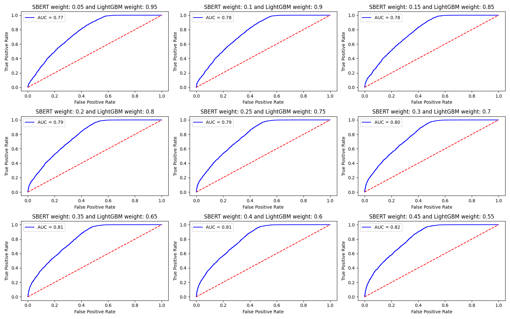

# Quora Question Pairs Duplicate Detection

## Overview
The goal of this project is to determine whether two questions posted on Quora have the same intent (duplicates). This project implements a **Hybrid Ensemble Model** that combines:
1.  **Deep Semantic Embeddings**: A Sentence-BERT (SBERT) model fine-tuned using **LoRA (Low-Rank Adaptation)** to capture deep contextual meaning.
2.  **Lexical & Statistical Features**: A **LightGBM** classifier trained on 13 hand-crafted features including Fuzzy String Matching, BM25 scores, and Jaccard similarity.

By combining semantic "understanding" with lexical "surface matching," the model achieves robust performance across diverse question types.


## Dataset Information  

The dataset is derived from the Quora Question Pairs competition.

* **Files:** `train.csv`, `test.csv`, `sample_submission.csv`
* **Total Pairs:** ~404,290 in the training set and ~1,000,000 in the testing set.
* **Evaluation Metrics:** ROC-AUC and Accuracy Percentage.

### Key Variables

| Variable | Description |
| :--- | :--- |
| **id** | The ID of a training set question pair. |
| **qid1, qid2** | Unique identifiers for each question. |
| **question1, 2** | The full text of each question. |
| **is_duplicate** | (Target) 1 if the questions have the same intent, 0 otherwise. |


## File Description

| File Name | Description |
|---|---|
| `SBERT_embedding.py` | Fine-tunes `all-mpnet-base-v2` using **LoRA**. Implements a multi-loss strategy (MNRL, Triplet, Cosine, and Softmax) to optimize embeddings. |
| `LightGBM_lexical.py` | Extracts 13 lexical features (Fuzzy ratios, BM25, TF-IDF) and trains a LightGBM GOSS classifier. |
| `GridSearch_ROC_AUC.py` | Optimizes the ensemble weights ($w_1, w_2$) by iterating through weight combinations to maximize AUC. |
| `LinearSearch_Binary_Threshold.py` | Finds the optimal classification threshold to maximize accuracy on the ensemble scores. |
| `Final_Training.py` | The main execution script that trains both models on the full dataset and saves the weights. |
| `Inference_Quora_Contest.py` | High-speed, multi-processed inference script that processes the test set in batches. |
| `ROC_AUC_Grid_Search.png` | Visualization of the ROC curves for different ensemble weight configurations. |

## Methodology

### 1. Semantic Fine-Tuning (SBERT + LoRA)
To optimize performance without the high computational cost of full-model fine-tuning, we apply **LoRA** to the SBERT `query`, `key`, and `value` modules. The model is trained using a multi-objective loss strategy to learn robust embeddings:
* **Multiple Negatives Ranking Loss (MNRL)**
* **Triplet Loss** (using Euclidean distance)
* **Cosine Similarity & Softmax Loss**

### 2. Lexical Feature Engineering
The LightGBM model utilizes specialized features to catch word-level similarities:
* **String Ratios:** Length ratios, Fuzzy partial ratios, and Levenshtein distance.
* **Set Metrics:** Word overlap and Jaccard similarity.
* **Statistical Metrics:** BM25 scores, TF-IDF, and Bag-of-Words (BoW) cosine similarity.

### 3. Ensemble & Threshold Optimization
The final prediction is a weighted average of the SBERT cosine similarity and the LightGBM probability:
$$\text{Final Score} = (w_{SBERT} \cdot \text{SBERT}) + (w_{LGBM} \cdot \text{LightGBM})$$
Through `GridSearch_ROC_AUC.py`, the optimal weights were determined (e.g., SBERT: 0.45, LightGBM: 0.55). A linear search is then performed to determine the best binary classification threshold.

## Visualization and Analysis



The ROC-AUC graph illustrates the performance of various weight distributions. By ensembling the models, we achieve a more stable classification boundary than either model could provide individually. The "Ensemble" approach effectively mitigates cases where SBERT might be "over-analytical" or LightGBM might be too literal.

## Technical Stack

| Area | Technologies |
|---|---|
| **Deep Learning** | PyTorch, Sentence-Transformers, PEFT (LoRA) |
| **Machine Learning** | LightGBM, Scikit-learn, Rank-BM25 |
| **Data Processing** | Pandas, NumPy, Joblib |
| **NLP** | NLTK (Lemmatizer), Contractions, Regex, Levenshtein |

## How to Run

1.  **Clone the Repository**:
    ```bash
    cd "Your Directory"
    git clone https://github.com/Dochikhoa2006/Quora-Question-Pairs-Duplicate-Detection.git
    ```

2.  **Install Dependencies**:
    Make sure you have Python and the necessary libraries installed:
    ```bash
    pip install pandas numpy sentence_transformers peft torch nltk python-Levenshtein scikit-learn rank_bm25 lightgbm
    ```

3.  **Cross-Validation & Optimization**:
    * To run SBERT Model:
        ```bash
        python SBERT_embedding.py
        ```
    * To run LightGBM Model:
        ```bash
        python LightGBM_lexical.py
    * To visualize performance:
        ```bash
        python GridSearch_ROC_AUC.py
        ```
    * To finalize labeling threshold:
        ```bash
        python LinearSearch_Binary_Threshold.py

4.  **Training**:
    * To collect trained models:
        ```bash
        python Final_Training.py
        ```

5.  **Inference (Recommendation)**:
    * To evaluate models:
        ```bash
        python Inference_Quora_Contest.py
        ```

## License

This project is licensed under the **CC-BY (Creative Commons Attribution)** license.

## Citation

Do, Chi Khoa (2026). *Quora Question Pairs*.  

🔗 [Project Link](https://github.com/Dochikhoa2006/Quora-Question-Pairs-Duplicate-Detection)

## Acknowledgements

This README structure is inspired by data documentation guidelines from:

- [Queen’s University README Template](https://guides.library.queensu.ca/ReadmeTemplate)  
- [Cornell University Data Sharing README Guide](https://data.research.cornell.edu/data-management/sharing/readme/)  


This project utilizes the **Quora Question Pairs Dataset**, available on Kaggle:

- [Quora Question Pairs](https://www.kaggle.com/competitions/quora-question-pairs/overview)

## Contact
If you have any questions or suggestions, please contact [dochikhoa2006@gmail.com](dochikhoa2006@gmail.com).


