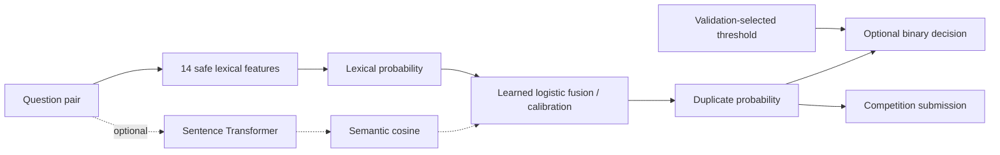

# Quora Duplicate Question Detection

[](https://github.com/Dochikhoa2006/Quora-Question-Pairs-Duplicate-Detection/actions/workflows/ci.yml)
[](https://github.com/Dochikhoa2006/Quora-Question-Pairs-Duplicate-Detection/actions/workflows/security.yml)
[](https://www.python.org/)
[](LICENSE)

A reproducible, portfolio-oriented system for estimating whether two questions
express the same intent. The default baseline is lightweight and fully local.
An optional Sentence Transformers model adds semantic similarity.

This repository does **not** claim accuracy on the Quora competition test set:
those labels are hidden. It writes submission probabilities and reports metrics
only for labeled held-out data.

## Navigation

- [Why this project](#why-this-project)
- [Architecture](#architecture)
- [Quick start](#quick-start)
- [Training and semantic fine-tuning](#train-on-quora-question-pairs)
- [Prediction and evaluation](#prediction-and-evaluation)
- [Quality and security](#quality-and-security)
- [Limitations](#responsible-use-and-limitations)
- [Documentation](#documentation)

## Why this project

Duplicate-question detection is a useful NLP problem because lexical overlap is
not the same as shared intent. The project also exposes a broader engineering
challenge: a promising model is not portfolio-ready unless its evaluation,
artifacts, deployment path, and claims are trustworthy.

Version 2 demonstrates four complementary skills:

| Area | Evidence in this repository |
|---|---|
| Applied NLP | Symmetric lexical similarity and optional sentence embeddings |
| ML evaluation | Protected split roles, calibration, threshold selection, and probability metrics |
| Software engineering | Installable package, typed boundaries, CLI, tests, Docker, and documentation |
| ML security/governance | Non-executable artifacts, integrity checks, audits, model/data cards, and release gates |

## What changed in version 2

- Replaced the invalid `sample_submission.csv` “accuracy” calculation with
  deterministic train/validation/test evaluation.
- Made the positive decision rule consistent everywhere:
  `probability >= threshold`.
- Replaced manual averaging of cosine similarity and classifier probability with
  a learned logistic fusion layer fitted on validation data.
- Replaced pickle/joblib artifacts with validated JSON and numeric NPZ files
  loaded using `allow_pickle=False`.
- Replaced fragile NLTK/WordNet preprocessing with null-safe Unicode
  normalization and regex tokenization.
- Added optional `SentenceTransformerTrainer` fine-tuning with one documented
  CoSENT objective, a held-out evaluator, and optional LoRA.
- Added tests, CI, security scanning, a non-root Docker image, documentation, and
  an offline synthetic demo.

See the [technical audit](docs/TECHNICAL_AUDIT.md) for a finding-by-finding
migration record.

## Architecture


```mermaid
flowchart LR
    Q[Question pair] --> L[14 safe lexical features]
    L --> LP[Lexical probability]
    Q -. optional .-> S[Sentence Transformer]
    S -.-> CS[Semantic cosine]
    LP --> F[Learned logistic fusion / calibration]
    CS -.-> F
    F --> P[Duplicate probability]
    V[Validation-selected threshold] --> D[Optional binary decision]
    P --> D
    P --> C[Competition submission]
```

The threshold is used only when a binary decision is requested. Quora
competition submissions use probabilities.

For the lifecycle diagram, module contracts, and extension points, see the
[architecture guide](docs/ARCHITECTURE.md) and its
[decision records](docs/decisions/README.md).

## Safe lexical features

The baseline uses these symmetric features:

1. Character-length ratio
2. Token-length ratio
3. Normalized character-length difference
4. Normalized token-length difference
5. Dice token overlap
6. Jaccard token similarity
7. Token containment
8. Sequence similarity
9. Token-sort similarity
10. Numeric-token overlap
11. First-token agreement
12. Last-token agreement
13. Exact normalized match
14. Character n-gram TF-IDF cosine

Missing values become empty strings. Empty questions and empty token sets have
explicit finite behavior; there are no divisions by zero or external language
resource downloads.

## Quick start

Python 3.11–3.13 is supported.

```bash
python3 -m venv .venv
source .venv/bin/activate
make install-dev
make test
```

Run a complete offline smoke test without downloading Quora data:

```bash
make demo
qqdup train \
  --data data/demo_train.csv \
  --output artifacts/demo \
  --config config/default.json

qqdup predict \
  --input data/demo_train.csv \
  --artifact artifacts/demo \
  --output outputs/demo_predictions.csv
```

The demo is synthetic and is a software check, not a benchmark.

## Lexical baseline evaluation

The version 2 lexical baseline was run on all 404,290 labeled training pairs with
the committed seed-42 configuration. Fusion/calibration and the F1 threshold
were selected on validation; the local test partition remained untouched until
final evaluation.

| Local labeled test (60,644 pairs) | Value |
|---|---:|
| Log loss ↓ | **0.5300** |
| Brier score ↓ | **0.1807** |
| ROC-AUC ↑ | **0.7905** |
| Average precision ↑ | **0.6299** |
| F1 at validation-selected threshold 0.23 ↑ | **0.6728** |

This is a **pair-stratified local holdout**, not hidden competition performance.
Repeated questions may cross partitions, so stronger claims require the
question-disjoint evaluation on the [roadmap](ROADMAP.md). See the
[aggregate report](reports/lexical-v2-pair-stratified.json) and
[model card](models/LEXICAL_BASELINE_V2_MODEL_CARD.md) for full precision,
provenance, accuracy/recall tradeoffs, and limitations.

## Train on Quora Question Pairs

Download `train.csv` and `test.csv` through the
[official Kaggle competition](https://www.kaggle.com/competitions/quora-question-pairs/data)
after accepting its terms. Keep them under `data/`; datasets are intentionally
not committed.

Train the lexical baseline:

```bash
qqdup train \
  --data data/train.csv \
  --output artifacts/lexical-v1 \
  --config config/default.json
```

The artifact contains the exact configuration, dataset fingerprint, split
assignments, validation choices, and untouched held-out test metrics.

### Optional semantic fine-tuning

Install the optional dependencies:

```bash
python -m pip install --requirement requirements-semantic.txt
python -m pip install --no-deps --editable .
```

Fine-tune with CoSENT and a held-out evaluator:

```bash
qqdup train-semantic \
  --data data/train.csv \
  --output artifacts/semantic-cosent \
  --base-model sentence-transformers/all-mpnet-base-v2 \
  --lora
```

Then train calibrated hybrid fusion:

```bash
qqdup train \
  --data data/train.csv \
  --output artifacts/hybrid-v1 \
  --config config/default.json \
  --semantic-model artifacts/semantic-cosent/model
```

The semantic workflow follows the current Sentence Transformers
[`SentenceTransformerTrainer`](https://www.sbert.net/docs/package_reference/sentence_transformer/trainer.html)
API. Its documentation describes
[`CoSENTLoss`](https://www.sbert.net/docs/package_reference/sentence_transformer/losses.html#cosentloss)
as a stronger training signal than the older cosine-similarity loss for labeled
similarity pairs. LoRA uses the documented
[Sentence Transformers PEFT integration](https://www.sbert.net/examples/sentence_transformer/training/peft/README.html).

## Prediction and evaluation

Create a competition-compatible probability file:

```bash
qqdup predict \
  --input data/test.csv \
  --artifact artifacts/lexical-v1 \
  --output outputs/submission.csv
```

The command preserves `test_id` (or `id`) and writes `is_duplicate` as a
probability. It does not read `sample_submission.csv` and does not report
accuracy.

Evaluate only a genuinely labeled external file:

```bash
qqdup evaluate \
  --data data/my_labeled_holdout.csv \
  --artifact artifacts/lexical-v1 \
  --output outputs/external_evaluation.json
```

See [evaluation methodology](docs/EVALUATION.md) before interpreting metrics.

## Artifact format

```text
artifact/
├── manifest.json           # schema, configuration, decision rule, SHA-256 hashes
├── model.npz               # numeric parameters; loaded with allow_pickle=False
├── vocabulary.json         # character n-gram vocabulary
├── evaluation.json         # validation and held-out test report
└── split_assignments.csv   # reproducible row-to-split mapping
```

`qqdup inspect --artifact artifacts/lexical-v1` verifies hashes before printing
the manifest. Hashes detect corruption; they are not publisher signatures.

## Docker

```bash
docker build -t quora-duplicate-detection:local .
docker run --rm quora-duplicate-detection:local --help
```

The image runs as an unprivileged user. The Compose service adds a read-only root
filesystem, drops all Linux capabilities, and disables privilege escalation.

## Quality and security

| Gate | What it checks |
|---|---|
| Pytest + coverage | Unit, failure-boundary, artifact, CLI, and end-to-end behavior |
| Ruff | Static correctness rules and deterministic formatting |
| Bandit | Common Python security mistakes |
| pip-audit | Known vulnerabilities in core and optional semantic dependencies |
| Dependency review | Vulnerable dependency changes in pull requests |
| CodeQL | Repository-level Python security analysis |
| Docker smoke test | Image construction and installed CLI startup |
| Dependabot | Scheduled dependency and GitHub Actions update proposals |

The current local validation record is a software-quality check, not a model
benchmark. Consult the GitHub Actions results for the public commit being used.

## Repository map

```text
src/quora_duplicate_detection/  reusable package and CLI
tests/                          automated unit and end-to-end tests
scripts/                        offline demo-data generator
config/                         versioned training configuration
docs/                           architecture, evaluation, audit, and release guides
docs/decisions/                 architecture decision records
models/                         release model-card template
reports/                        aggregate benchmark-report policy
.github/workflows/              CI and security automation
.github/ISSUE_TEMPLATE/         structured community intake
```

## Responsible use and limitations

- This is a research/portfolio classifier, not a moderation or enforcement
  system.
- Quora data can contain personal, offensive, or otherwise sensitive text.
  Follow the dataset terms and avoid publishing raw examples unnecessarily.
- A pair-level stratified split can place the same question in more than one
  partition. Use question-disjoint grouped evaluation before making stronger
  generalization claims.
- Performance and calibration can shift across domains, languages, time, and
  class prevalence.
- Do not publish metric claims until they are generated by the committed code
  and recorded in a completed model card.

## Documentation

- [Documentation map](docs/README.md)
- [Architecture](docs/ARCHITECTURE.md) and [decision records](docs/decisions/README.md)
- [Full technical audit](docs/TECHNICAL_AUDIT.md)
- [Evaluation methodology](docs/EVALUATION.md) and [data card](docs/DATA_CARD.md)
- [Reproducibility](docs/REPRODUCIBILITY.md) and [release guide](docs/RELEASE.md)
- [Migration and Git push guide](docs/MIGRATION_AND_GIT_GUIDE.md)
- [LinkedIn showcase guide](docs/LINKEDIN_SHOWCASE.md)
- [Model card template](models/MODEL_CARD_TEMPLATE.md)
- [Lexical baseline model card](models/LEXICAL_BASELINE_V2_MODEL_CARD.md) and
  [aggregate evaluation report](reports/lexical-v2-pair-stratified.json)
- [Security policy](SECURITY.md), [contributing guide](CONTRIBUTING.md), and
  [changelog](CHANGELOG.md)
- [Project roadmap](ROADMAP.md)

## Contributing and citation

Contributions are welcome through focused issues and reviewed pull requests.
Read [CONTRIBUTING.md](CONTRIBUTING.md) and the
[code of conduct](CODE_OF_CONDUCT.md) first.

GitHub can generate citation formats directly from [CITATION.cff](CITATION.cff).
Dataset and pretrained-model citations remain separate from the software
citation.

## License

Project code and original documentation are offered under
[CC BY 4.0](LICENSE). The Quora dataset and third-party models retain their own
terms and are not relicensed here.
