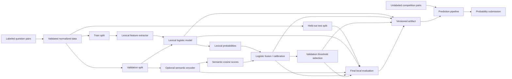
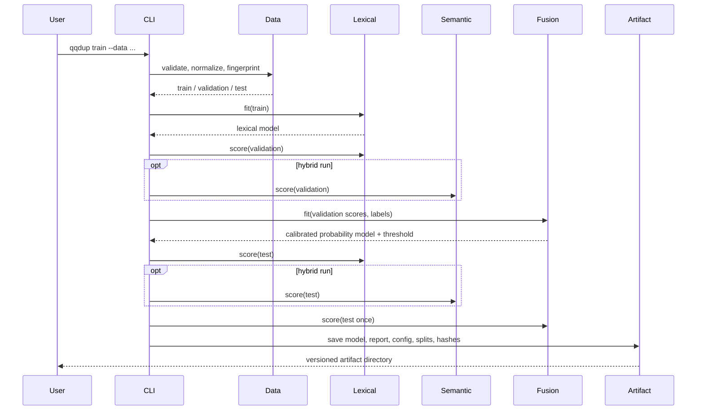

# Architecture

## Design goals

The system is designed around six properties:

1. **Evaluation integrity** — unlabeled competition data never enters a metric.
2. **Reproducibility** — splits, configuration, and dataset identity are recorded.
3. **Portable baseline** — lexical training needs no GPU or downloaded NLP corpus.
4. **Optional semantics** — transformer dependencies stay outside the core path.
5. **Safe artifacts** — runtime loading accepts declared numeric arrays, not
   executable Python object graphs.
6. **Honest failure** — malformed data and incompatible artifacts fail with an
   actionable error instead of silently changing behavior.

## System context



The held-out test partition is downstream of every selection decision. The
competition path terminates in probabilities and has no label-dependent metric.

## Package boundaries

| Module | Responsibility | Must not do |
|---|---|---|
| `config.py` | Validate versioned hyperparameters | Read mutable global settings |
| `data.py` | Normalize, validate, fingerprint, and split pairs | Fit model state |
| `features.py` | Learn TF-IDF state and compute 14 symmetric features | Access labels |
| `lexical.py` | Fit and score the portable logistic baseline | Serialize Python estimators |
| `semantic.py` | Optional CoSENT/LoRA training and embedding scoring | Become a core import requirement |
| `ensemble.py` | Calibrate/fuse component scores and select thresholds | Inspect held-out test labels during selection |
| `metrics.py` | Compute labeled probability and decision metrics | Infer whether labels are genuine |
| `artifacts.py` | Save/load strict JSON and NPZ schemas with integrity checks | Load pickle or arbitrary modules |
| `pipeline.py` | Orchestrate lifecycle stages in the permitted order | Treat a submission template as observations |
| `cli.py` | Expose explicit user workflows | Hide material defaults or mutate remotes |

## Training sequence



## Feature pipeline

Normalization is intentionally conservative: Unicode NFKC, case folding, and
whitespace collapse. It does not silently remove punctuation or apply an
English-only lemma model.

The features cover four views:

- **Length:** character/token ratios and normalized differences
- **Token sets:** Dice, Jaccard, containment, numeric overlap, boundary agreement
- **Order/string:** sequence similarity, token-sort similarity, exact match
- **Corpus statistics:** character n-gram TF-IDF cosine

Every feature is symmetric under swapping `question1` and `question2`. Tests
enforce symmetry and finite values for missing and empty input.

## Probability and decision semantics

The lexical model produces a probability-like score. Optional semantic cosine
is on a different scale. Logistic stacking maps either one component or both
components to one calibrated probability space.

A threshold produces a binary decision only when requested:

```text
duplicate = probability >= threshold
```

Submission output remains probabilistic.

## Artifact boundary

```text
artifact/
├── manifest.json
├── model.npz
├── vocabulary.json
├── evaluation.json
└── split_assignments.csv
```

Loading checks the schema version, artifact type, exact feature list, exact NPZ
array names, array shapes, finite values, vocabulary indices, decision
direction, and SHA-256 file digests. This is corruption detection, not publisher
authentication; signed releases remain a future enhancement.

## Deployment model

The project is a batch CLI rather than a network service. This keeps the trust
boundary small and makes competition submissions and offline evaluation easy to
reproduce. A future API should wrap the package rather than duplicate feature or
artifact logic.

Docker runs the same CLI as an unprivileged user. Compose adds read-only root
storage, a temporary `/tmp`, dropped capabilities, and no-new-privileges.

## Extension points

- Add a question-disjoint splitter behind the same `DataSplits` contract.
- Add a new semantic scorer that returns one finite score per row.
- Add a fusion component by versioning the artifact schema and negative tests.
- Add calibration diagnostics without changing competition output columns.
- Add a service layer that calls `predict_probabilities` and enforces request
  size/rate boundaries.

Any schema or decision-semantics change requires an architecture decision record
and a major or minor version assessment.
